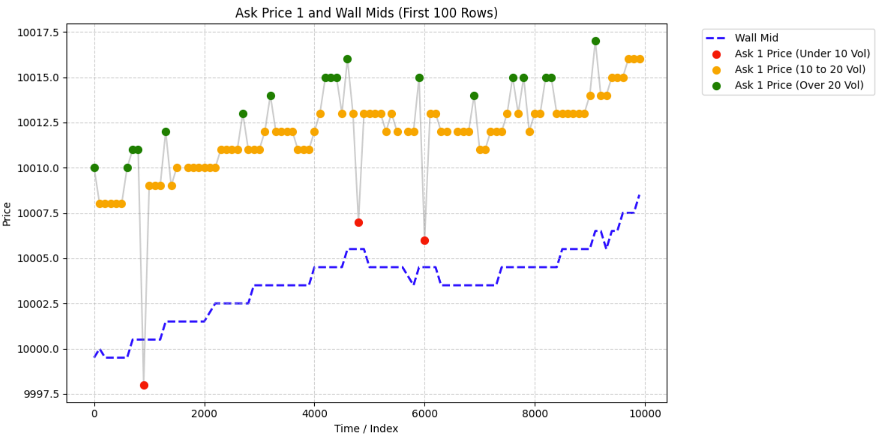
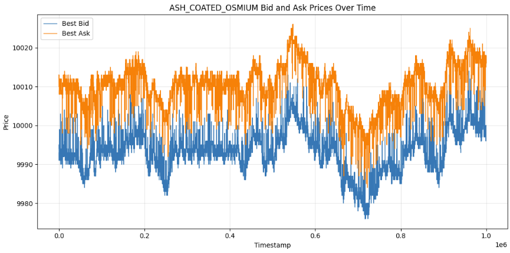
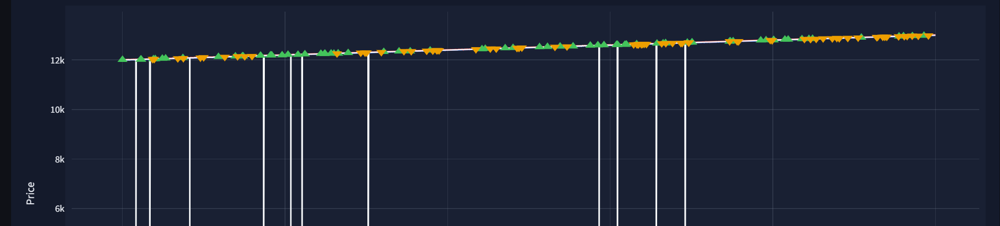
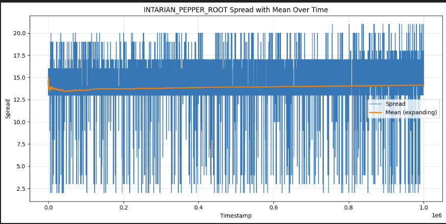
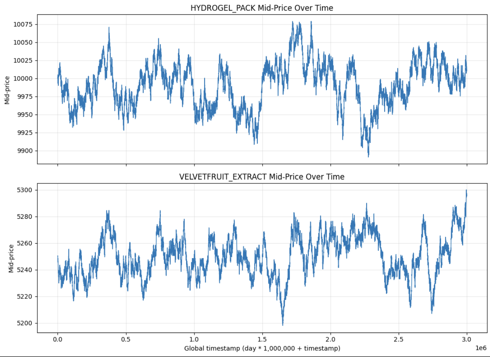
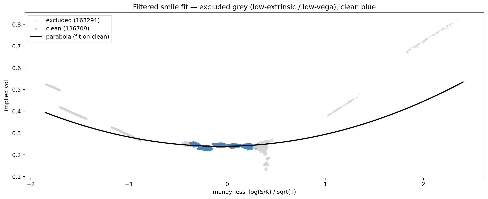
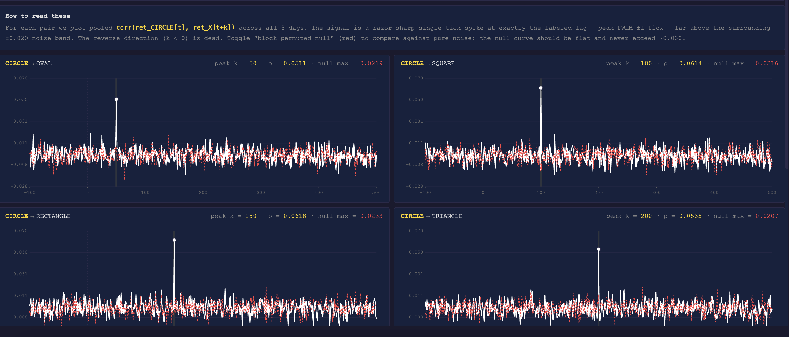
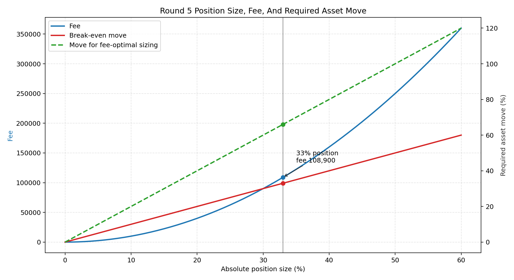

# IMC Prosperity 4 – Alpha Search Team

## Team Members
- [Fabian](https://linkedin.com/in/fabian-baier-tum/)
- [Giovanni](https://linkedin.com/in/giovanni-de-valdivia-bade-b63b93146/)
- [Caleb](https://linkedin.com/in/calebjl/)
- [Laurentiu](https://linkedin.com/in/lawrence-vasilescu/)
- [Tommy](https://linkedin.com/in/tommy-wong-998b68194/)

Our approach combined systematic quantitative research with execution-aware trading infrastructure, emphasizing robust signal discovery, market microstructure analysis, and inventory-aware optimization across multiple rounds of competition.

## Core Focus Areas
- Alpha signal research (microstructure, statistical, and cross-asset)
- Systematic strategy development
- Execution optimization and fill-probability modeling
- Risk and inventory management

## Results
- **4th place globally** out of 22,000+ teams in Round 4
- **23rd place** in the Round 3 algorithmic competition
- **27th place** in the Round 2 algorithmic competition

Through iterative research, simulation, and execution optimization, we developed scalable systematic trading strategies designed to perform under highly competitive market conditions.


## Overview

- [Algorithmic Challenge](#algorithmic-challenge)
  - [Round 1 and 2](#round-1-and-2)
  - [Round 3 and 4: Options Trading](#round-3-and-4-Options-Trading)
  - [Round 5: 50 assets tradable](#round-5-50-assets-tradable)

 - [Manual Challenge](#manual-challenge)
   - [Round 1: Walrasian Auction](#round-1-walrasian-auction)
   - [Round 2: Speed](#round-2-speed)
   - [Round 3: Choosing bids](#round-3-choosing-bids)
   - [Round 4: Options Portfolio Optimization](#round-4-options-portfolio-optimization)
   - [Round 5: News-based Portfolio](#round-5-news-based-portfolio)


## Algorithmic Challenge
Before the competition officially started, we prepared by building a backtester that satisfied our requirements. E.g.  we wanted some additional metrics to specify the risk of a trading strategy over another and how likely it is to be overfitted. We also built a dashboard to check if we can see some obvious patterns, like the informed trader "Olivia" in Prosperity 3, who always traded with volume 15. For the dashboard, we also added additional features, which we thought were useful.

One particularly useful extension was a per-tick PnL decomposition that splits realized P&L into directional carry (`pos × Δmid`, the gain or loss on inventory carried through price changes) and market-making capture (`Σ_fills Δq × (mid_at_fill − fill_price)`, positive for passive fills and negative for aggressive crosses). The two components sum back to the total PnL exactly. This let us tell whether a strategy was earning from price drift on existing positions versus from spread capture on new trades — a much sharper diagnostic than aggregate PnL alone, and the basis for distinguishing real edge from accidental directional drift in our backtests.

### Round 1 and 2
#### ASH COATED OSMIUM
For Osmium, the strategy was completely different from that of Pepper root. We first started our search for an appropriate fair value estimate. For this, we took a similar approach at the Frankfurt Hedgehogs, defining a wall mid, but with volumes as a filter for it. We would forward fill this if a value is missing on either side. We found a pattern of volumes quoted in the market, which was symmetric for bids and asks.

*Figure: Osmium bots over time*



Given this and the fact that Osmium was mean reverting we formulated the following strategy. If the ask price is smaller than the wall mid, we take it, analogously for the bid side. Additionally, we do market making with two different modes, depending, if the current quotes in the market are made by market makers or not. We classify the quote into an MM quote if the distance of it to the wall mid is larger than 5. In this case, we post at the best bid + 1 or best ask -1. If the quote isn't by an MM, then we quote around the wall mid shifted by an inventory skew and a half spread of 4. 

*Figure: Osmium over time*



#### INTARIAN PEPPER ROOT
Pepper root had a clear pattern with an underlying upward trend and mean reversion around this trend. So the baseline approach for this asset was to just buy as aggressively as possible at the start and hold until the end. One major feature was also that the spread was increasing over time; thus, using an if statement, if the mid price is above the fair value and then selling and buying it back immediately, might not be the best approach. 

*Figure: Pepper root over time*



We structured the trading strategy for this asset into three phases: accumulation, mean reversion and position unwinding.
For the accumulation phase, we wanted to get to the position limit of 80 as fast as possible, but not pay too much for this. E.g. if the third best ask price would be 20 points away from the mid price, we could just wait one time step and, on average, get a better execution price at the best ask (as the rate of the trend isn't that extreme; it was around 0.1 per tick). To optimize this approach, we also took into consideration the current spread and a future time steps mid price. Additionally, we always posted bid orders to match bots who would sell. This kind of strategy we used throughout all rounds: we take all the LOs of the bots quoted, which satisfy a criterion we would want to trade, and if we predict the direction, we use the remaining size to trade to post LOs. To decide where to post those LOs, we analysed at which prices the bots are most likely to post their orders to match us and used an empirical estimate of it.
After we accumulated the maximum volume we are allowed to hold, we went into a mean reversion around the trend strategy phase. We first needed to figure out which fair value estimate we would like to use.
In terms of logic, it would be a bad approach to think that the fair value at time t should be the midprice/microprice or any other common fair value estimate, as the underlying trend would be neglected. So we decided to take a future mid price as our fair value (which we could just easily calculate by the slope times time) and trade the deviations of quoted prices from it. For this, we had two approaches: one using the deviations and one using the spread behaviour.
For the first approach, we had the following logic: If the currently quoted best bid is above a future time steps mid price, we would take it. If this isn't the case, but I could post an ask order such that it is still above this fair value, I would do it and keep track, if it got executed. The second approach is more of a statistical one. It abuses the distribution of the spread, given a specific time frame. For this, we record a certain amount of spread values (not the entire distribution, as the spreads mean increases in time) and if the current spread value is larger than a specific quantile, we post an ask order at the best ask - 1. If it gets executed, we just buy back at the next time steps quoted best ask. On average, this should be highly profitable, as we are trading the outliers of the spread distribution for a time period. 
Lastly, as the spread was increasing and the last time steps mid price is used to settle the position we are holding, we would lose money at the end of the trading period. To reduce this loss, we start posting orders below the best ask to capture any incoming order flow. We start with this process close to the end of the period. In the worst case, if no bot sends out a buy order, we get the same mid price settlement as without using this strategy. 


*Figure: Pepper root spread over time*


What we missed for both assets was that if one side isn't quoted, we could quote extremely wide and still get filled.
Also, we expected a massive regime change due to the simplicity of this task, so we had a generalisation of this strategy to any slope of the trend, also negative implemented. And the regime change prediction was correct, just in another way, as round 3 was completely different from the years before, and the two assets for the first two rounds weren't traded anymore and the PnL was reset to 0.


### Round 3 and 4: Options Trading
For rounds 3 and 4, the assets of previous rounds weren't available to trade anymore. We first looked into potential relationships between Hydrogel and Velvetfruit, but didn't find any besides them both being mean reverting.


#### HYDROGEL PACK and VELVETFRUIT EXTRACT (VFE)
We tried several market making algorithms and different mean reversion approaches, but the market making approach didn't work, as there were too few incoming trades to get rid of the inventory before the market moved away. For the mean reversion part, we tested z-score-based approaches as well as VWAP, but the final solution, which performed best OOS a simple mean over time and taking the deviations from it. To optimize this approach, we used a prior based on the data from the previous days' data to start trading as soon as possible. Additionally, we posted limit orders to maximize the directional position size. We just posted the remaining position size after taking the orders quoted by bots, thus, in the worst case, getting no execution, in the best case, getting an execution in the direction we already wanted to trade at a better price. 

*Figure: Hydrogel and VFE over time*



#### Options on VFE
There were ten vanilla call options on VFE with strikes 4000, 4500, 5000, 5100, 5200, 5300, 5400, 5500, 6000, 6500.
For the options pricing, it was clear from the Wiki that we should use standard Black-Scholes pricing. The first thing we did was to get a volatility surface and see if there were any anomalies for the Greeks. After that, we checked for any convexity (butterfly spread arbitrage) violations, where there weren't any in the data. The next step was to check if there is any lead-lag relationship to find, given the current option prices and the approximate changes they should follow to the next time step. Again, nothing to be found here. As the underlying VFE was mean reverting, we couldn't trust any of the mean reverting options combinations. Through time, the volatility surface wasn't stable, so we couldn't trade that either. As the price of the underlying VFE was around 5200-5300, 6000 and 6500 strikes were far OTM and traded between 0 and 1. For round 3, we didn't trade those at all and only included them in round 4 after seeing which bots took what kind of trades. For the other options, they all followed the underlying's direction perfectly;  thus, just trading the underlying and doing the same trades with each of the options seemed to be the best option (or choice, if you don't like the word play).
We also briefly tried an IV scalping variant on the vouchers themselves. The setup used a fitted smile, Black-Scholes fair values, and then traded the residual between market mid and smile-implied fair value. We tested both pooled z-score triggers across vouchers and per-voucher absolute residual thresholds around a rolling mean, especially for the strikes around the money such as 5100-5500. The idea was that relative value dislocations might mean revert even if outright price direction was noisy. In practice, the edge was too inconsistent once spread costs, fill uncertainty, and unstable surface dynamics were taken into account, so this remained an experiment rather than part of the final production strategy.

One reason we did not push further on pure smile trading was that even the cleaned fit came at a fairly high cost in sample size. We could get a visually reasonable parabola only after excluding low-extrinsic and low-vega observations, but that removed more than half of the raw points, which made us uncomfortable treating the resulting surface as a robust production signal rather than a diagnostic tool.

*Figure: Filtered Round 3 voucher smile fit — excluded points are grey, retained points blue, fitted parabola in black. The fit looks cleaner after filtering, but only about 45.6% of observations survive the quality screen.*



#### Informed/Uninformed Traders

For round 4, we were given the data set with added bot names for each trade. We extended this data set by also getting who is quoting at which price for every time step, and at which prices bots are most likely to take it (only for the website data, thus we had too few data points for the trades analysis).
We tried to analyze which bots make positive EV predictions over several different time frames. We split that into two parts, one observing the quoted side, and classifying if they are informed or not and for the aggressive sides trades. Only Mark 67 seemed to have a clear edge here, but the edge was too insignificant to outperform our round 3 algorithm due to high transaction costs. Some of the bots were also trading only at a specific price (one was always selling at the price of 7). We also tried to classify into informed/uninformed based on the volumes of the Mark's. 
We posted bids at 0 and asks at 1 for the 6000 and 6500 strikes, after seeing that Mark 22 sells them at 0. 

### Round 5: 50 assets tradable
In round 5, due to the enormous amount of tradable assets, we needed to rethink our approach. We first tried to find pairs which would cointegrate and classify the assets into common behaviour. For the former, we found that almost all apparent cointegrations did not hold out of sample.

To narrow the search before running the expensive cointegration scans, we ran multi-horizon PCA at horizons {1, 100, 500} ticks. The slow-horizon PCA picked up the Microchip lead-lag synchronization at h=500 (where the 200-tick lag chain is fully inside the horizon window) even though tick-level PCA at h=1 showed nothing. We also ran an intra-category PCA prioritization step (PCA on each category's 5×5 covariance separately) to identify which categories had a dominant common factor — this prevented us from over-fishing the categories where no relationship existed.

The main lesson was that basket discovery is a multiple-testing problem. If thousands of candidate baskets are tested, a raw p-value below 0.05 is not strong evidence by itself. In fact, accepting a basket when any one of three folds has p < 0.05 gives a false-positive probability of about 1 - 0.95^3 = 14.3% under a no-edge null. At the scale of our search, this produces many visually plausible but spurious baskets.

To reduce this, we treated the statistical tests as a screening layer, not as the final decision rule. The clean chronological validation was:

- train on day 2, test on day 3
- train on days 2 and 3, test on day 4

We also used leave-one-day-out folds such as train on days 2 and 4, test on day 3, and train on days 3 and 4, test on day 2. Those folds are not a true live trading simulation, because they use future data relative to the test day. We used them only as stability diagnostics: if a basket only worked in one split and broke in the others, it was more likely to be a day-specific accident.

Another way we controlled the search was by moving from arbitrary continuous hedge ratios to a small integer lattice and by searching mostly within product categories. A free OLS basket can always find fragile decimal coefficients that make the in-sample residual look stationary, especially when many unrelated products are tested. Those coefficients are also harder to interpret, harder to size under position limits, and more likely to drift between days. Restricting the search to small round-number weights, usually in a range such as -3 to 3, reduced the number of candidate baskets. Restricting the search to products from the same category added a structural prior: it is more plausible that variants of the same product family share a pricing relationship than that an arbitrary mix of unrelated assets does. Neither restriction eliminates overfitting, but together they reduce the hypothesis space and make the surviving baskets more interpretable: if a relationship only worked with a very specific decimal coefficient or a cross-category mixture with no story, we treated it as less trustworthy than one that survived with simple ratios like 3:2:1 or 1:3:3:1 inside a category.

For each candidate basket, we looked at the train ADF p-value, the held-out test ADF p-value, a same-mean ADF test around the train-fitted mean, the shift in test mean measured in train sigmas, the ratio of test sigma to train sigma, half-life, crossing rate, and after-cost backtest PnL. We also inspected the spread plots. The plots helped catch problems that a p-value can hide, such as slow trending, one large reversal driving the result, a mean shift between days, or a spread that is statistically stationary but too slow or too expensive to trade. However, those plots were diagnostic rather than independent proof; once a plot is selected after a large search, it has the same selection-bias issue as the p-value.

A non-obvious lesson we kept hitting was that statistical confidence and trading edge size are independent. Snackpack pair trades had near-zero q-values (very clean statistically) but small per-trade edge after costs because the spread sigma was tight. Robot and Sleep Pod baskets had weaker q-values but much larger edge per round trip. Sizing strategies by q-value would have ranked them backwards. We instead used `(σ / cost) × (1 / half_life)` as our EV proxy: edge per cost paid, multiplied by reversion frequency. This captures both per-trade economics (does each round trip pay after cost?) and trading frequency (how often do we get a round trip?). It became the primary ranking score for our basket finalists.

A separate empirical pattern across the basket strategies: the best mean-reverters spent most of their time at full position, flipping from long-limit to short-limit as the spread reversed sign rather than exiting through zero between cycles. We used this to motivate hysteresis logic — a small dead zone around fair value where positions were held rather than rapidly cycled, saving spread costs on what would otherwise be unnecessary in-and-out trades.

The Bonferroni correction makes the same point. If we correct only across the final shortlist of seven baskets, the threshold is 0.05 / 7 = 0.0071, and UV, Microchip, Snackpack B, Robot, and Translator pass on their descriptive all-day ADF p-values. Sleep and Snackpack A do not. But this is too generous because the shortlist was chosen after a much larger search. Correcting across the true search space would require p-values on the order of 10^-6 or smaller, and essentially none of the discovered baskets should be described as Bonferroni-clean. We therefore used p-values as a sanity check, and relied more on structural simplicity, cross-day PnL consistency, and execution feasibility.

The final basket-style signals we used were:

- Purification Pebbles: hard structural relationships, especially XS + S following a downward time trend, M + L around a fixed level, and XL priced from the rest of the basket.
- UV-Visors: 3 * MAGENTA + 2 * AMBER + RED around 60k. This was the cleanest integer basket.
- Domestic Robots: MOPPING + 3 * VACUUMING + 3 * DISHES + IRONING.
- Sleep Pods: LAMB_WOOL + 2 * SUEDE - 3 * POLYESTER + 2 * COTTON. This was weaker, so we treated it more cautiously.
- Instant Translators: SPACE_GRAY + 2 * ASTRO_BLACK - 3 * ECLIPSE_CHARCOAL + GRAPHITE_MIST + 3 * VOID_BLUE. This was also weaker statistically, but had useful after-cost behaviour.
- Organic Microchips: RECTANGLE - 2 * OVAL + 3 * TRIANGLE, used mainly as a signal to trade TRIANGLE rather than as a fully hedged basket.
- Protein Snack Packs: VANILLA - CHOCOLATE, and PISTACHIO + STRAWBERRY - RASPBERRY, traded more as short-horizon/EMA mean reversion than as perfectly clean long-run cointegration.

We explicitly rejected many statistically tempting baskets in Oxygen, Galaxy Sounds, and Construction Panels because they did not survive the held-out tests well enough or did not have convincing after-cost behaviour. Some products from those categories were still traded directionally or market-made, but not because of a strong cointegration claim. In particular, OXYGEN_SHAKE_GARLIC, GALAXY_SOUNDS_BLACK_HOLES, and PANEL_2X4 showed positive long-only PnL on every historical day we had. The fact that these came from categories where basket mean reversion failed was also useful: it suggested that the edge in those categories was more likely an outright drift/trend effect in a specific product than a stable intra-category relative-value relationship.


#### Purification Pebbles: XS - XL
For Pebbles, there was a strict relationship that all components added had the value 50k. We used this to improve the fair value for XL to do market making around 50k - midprice of the components. For XS and S, there was a relationship similar to Pepper root, but now downwards trending: XS+S = 20k - slope times time. We used the same strategy as for Pepper root here, just with the combination of XS and S. For M and L, we used a mean reversion approach.

#### Organic Microchips
For Microchips, we found a lead-lag relationship between Circle and the other assets, with Circle leading (see the figure below). Specifically, CIRCLE led OVAL, SQUARE, RECTANGLE and TRIANGLE at lags of {50, 100, 150, 200} ticks. With a search window of `maxlags = 247` (a deliberately non-round upper bound), the probability that all four lead-lag pairs would land on multiples of 50 by chance is `(4/247)^4 ≈ 7×10⁻⁸`, effectively ruling out coincidence — a clean structural fingerprint that validated the relationship beyond p-value alone. Knowing such a relationship exists, we only traded the 4 other assets of microchips, excluding Circle. The strategy was simply that if Circle made a large enough directional movement over a specified period, we would trade it in all of the other assets with respect to the lag. For risk management, as it wasn't a perfect correlation, we would exit if the price change didn't behave as expected. Also, we would continue to stay in this position as long as Circle is moving in this direction, if our prediction is correct.

Earlier in the analysis we briefly observed apparent cross-category lagged correlations of around 0.30 between certain pairs (e.g. OXYGEN_SHAKE_CHOCOLATE → SNACKPACK_CHOCOLATE). A sanity check via independent NumPy computation revealed a pandas index-alignment bug in our analysis script — the actual correlations at those lags were essentially zero. After this we made a habit of cross-checking every claimed lead-lag finding through a second independent implementation before treating it as real. The Microchip {50, 100, 150, 200} fingerprint survived that re-validation; the cross-category candidates did not.

*Figure: Lead-lag relationship of microchips*



#### UV-Visors
UV had one of the cointegrations, which held strongly. It had the weights and assets: 3 magenta, 2 amber and 1 red, with a constant mean of around 60k. We traded the deviations from this mean with the appropriate weights and scaled them up to the position limit of 10. In the final trader this was implemented with deterministic integer targets/rounding, not stochastic rounding.

#### Market Making
For every volume, which wasn't used by another strategy, we used market making, if the asset allowed for it. This only uses up to size 2 per asset (tested the optimal ratio). For the market making algorithm itself, we needed to select an approach which has minimal parameters across all of the traded assets. For this, we had a percentage-based approach to make assets comparable and decide on their spread given some simple heuristics, which we can tune. Additionally, due to the fact that some had smaller spreads, we needed some logic for the edge cases, e.g. if the quoted spread is 3 or smaller.

#### Strategy Coordination
The final trader coordinated 15+ sub-strategies in a single top-level controller. To prevent the failure mode where market-making would sell a product to capture spread and a structural mean-reversion strategy would immediately buy it back at higher cost (effectively paying the spread to ourselves), we implemented hard product-ownership: each product was claimed by at most one structural strategy, and market-making operated only on products with no claimed structural edge. Per-basket MM layers ran during hysteresis bands when the basket was idle, capturing additional spread on otherwise unused leg capacity without conflicting with the basket's directional logic. State for each sub-strategy was persisted in a shared `traderData` dict keyed by strategy name, so each sub-strategy kept its own EMA values, position trackers and signal histories independently across ticks.


 ## Manual Challenge

 ### Round 1: Walrasian Auction
 There were two auctions, which you can participate in, both with price-time priority, where you were the last person to submit an order before the clearing price was decided to maximize traded volume. The solution was straightforward, if you know how the Walrasian auction works (it wasn't mentioned in the challenge, of course). We knew that after the clearing price is decided, we would be able to settle the position at a specified price, 30 for the first auction and 20 for the second auction. There were two approaches we followed: just looking at the orders of the others in the market and brute-forcing the answer. We did both to double-check our result, and they agreed. To brute-force it, you just need to calculate the clearing price, given the intended trade you will do (with both specified price and volume, over which you loop) and just calculate the PnL of it. Then you take the maximum of those outputs as your intended trade.

### Round 2: Speed

### Round 3: Choosing bids

#### Problem Setting

In the Round 3 manual challenge, we traded with counterparties whose reserve prices were uniformly distributed between 670 and 920 in increments of 5. After buying from these counterparties, every unit could be resold the next day at the known fair value of 920. The strategic choice was to submit two bids, with the first bid capturing the low-reserve counterparties and the second bid targeting the remaining higher-reserve counterparties:

$$
b_1 \leq b_2.
$$

The key complication was that the second bid was compared against the average second bid of all players, denoted $\bar{b}_2$. If our second bid was at or above this average, the second-bid trade earned its full margin. If it was below the average, the second-bid profit was multiplied by the penalty

$$
\left(\frac{920 - \bar{b}_2}{920 - b_2}\right)^3.
$$

This made the problem partly game-theoretic: the value of our second bid depended not only on the reserve distribution, but also on what other players were expected to submit.

#### Expected PnL Model

Let

$$
\mathcal{R}=\{670,675,680,\ldots,920\}
$$

be the set of reserve-price levels, and let $N=300$ be the number of counterparties at each reserve level. For a bid $b$, the number of counterparties with reserve price below the bid is 

$$
Q(b)=N\sum_{r\in\mathcal{R}}\mathbf{1}_{r \lt b}.
$$

Here $\mathbf{1}_{r \lt b}$ equals 1 when reserve level $r$ is below bid $b$, and 0 otherwise.

For two bids, the first bid fills

$$
Q_1(b_1)=Q(b_1),
$$

and the second bid fills the additional quantity

$$
Q_2(b_1,b_2)=Q(b_2)-Q(b_1).
$$

The per-unit margins are $920-b_1$ and $920-b_2$. Therefore, for a given assumed average second bid $\bar{b}_2$, the modeled PnL was

$$
\Pi(b_1,b_2;\bar{b}_2)
=Q_1(b_1)(920-b_1)+Q_2(b_1,b_2)(920-b_2)M(b_2,\bar{b}_2),
$$

where

$$
M(b_2,\bar{b}_2)=
\begin{cases}
1, & b_2\geq \bar{b}_2,\\
\left(\dfrac{920-\bar{b}_2}{920-b_2}\right)^3, & b_2<\bar{b}_2.
\end{cases}
$$

We searched over all integer bid pairs $b_1\leq b_2$ and selected the pair with the highest modeled PnL.

#### Nash Equilibrium Assumption

Our starting point was a symmetric-player assumption. Suppose every strategic player has the same information, solves the same expected-PnL problem, and believes the average second bid will be $\bar{b}_2$. Then each player has a best response

$$
BR(\bar{b}_2)=\arg\max_{b_1\leq b_2}\Pi(b_1,b_2;\bar{b}_2).
$$

A symmetric Nash equilibrium occurs when the assumed average second bid is consistent with the second bid produced by the best response. If

$$
BR(\bar{b}_2)=(b_1^\ast,b_2^\ast),
$$

then a symmetric fixed point requires

$$
b_2^\ast=\bar{b}_2.
$$

The grid search found several fixed points, but the most profitable one was

$$
(b_1,b_2)=(751,836),
$$

with modeled PnL

$$
\Pi(751,836;836)=1{,}290{,}300.
$$

This was the natural Nash-equilibrium benchmark. The first bid, 751, captured the low-reserve counterparties from 670 through 750. The second bid, 836, captured the next reserve levels while staying exactly at the assumed average second bid, so the second leg received no penalty.

#### Why We Deviated

The equilibrium calculation was clean, but the live manual challenge was not a closed classroom game. The actual average second bid was produced by many teams, some of whom might not use the same model, might round differently, or might intentionally bid above the equilibrium to avoid being penalized. This made the nominal Nash bid $b_2=836$ fragile: if the true average second bid ended even slightly above 836, then our second bid would fall below the average and the cubic penalty would apply.

For example, if the true average were 838 while we bid 836, the second-bid multiplier would be

$$
\left(\frac{920-838}{920-836}\right)^3
=\left(\frac{82}{84}\right)^3
\approx 0.930.
$$

That penalty is much larger than the small amount of expected value sacrificed by bidding a few points higher. We therefore kept the first bid at 751 and raised the second bid from 836 to 841:

$$
(b_1,b_2)=(751,841).
$$

This robust deviation preserved almost all of the model value. Under the model, the equilibrium pair earned 1,290,300, while the robust pair earned

$$
\Pi(751,841;840)=1{,}288{,}500.
$$

The difference was only 1,800, or about 0.14% of modeled PnL. In exchange, the higher second bid protected us against a moderate upward shift in the average second bid.

| Case | Bid pair | Modeled PnL | Interpretation |
|---|---:|---:|---|
| Single-bid optimum | `(791, -)` | 967,500 | Ignores the value of bid segmentation |
| Nash benchmark | `(751, 836)` | 1,290,300 | Best symmetric fixed point |
| Robust deviation | `(751, 841)` | 1,288,500 | Small EV loss, lower penalty risk |

### Round 4: Options Portfolio Optimization

#### Problem Setting

In the Round 4 manual challenge, the task changed from a strategic bidding game into a derivatives portfolio construction problem. We could trade `AETHER_CRYSTAL`, several vanilla calls and puts, and three exotic derivatives: a chooser option, a binary put, and a knock-out put. The score was the average PnL across 100 simulated paths of the underlying.

The underlying was generated by a Geometric Brownian Motion model with

$$
S_0=50,\qquad \mu=0,\qquad \sigma=251\%,
$$

using 4 time steps per trading day and 252 trading days per year. The two-week options expired after 10 trading days, while the three-week vanillas and exotics expired after 15 trading days. A manual order therefore had to balance expected value against the risk that only 100 realized paths would determine the final score.

Unlike Round 3, there was no average bid or direct dependence on other players' submissions. The natural benchmark was not a Nash equilibrium, but the risk-neutral expected-value portfolio implied by the known GBM simulator and the displayed bid/ask prices.

#### Payoff Model

For each simulated path, we computed the payoff of every instrument. For a vanilla option with strike $K$, the terminal payoffs are

$$
C_T=\max(S_T-K,0),\qquad P_T=\max(K-S_T,0).
$$

The chooser option is decided after two weeks. If $S_\tau>50$ at the decision time $\tau$, it becomes a call; otherwise it becomes a put:

$$
X_{\text{chooser}}=
\begin{cases}
\max(S_T-50,0), & S_\tau>50,\\
\max(50-S_T,0), & S_\tau\leq 50.
\end{cases}
$$

The binary put pays 10 if $S_T<40$, and 0 otherwise:

$$
X_{\text{binary put}}=10\mathbf{1}_{\{S_T<40\}}.
$$

The knock-out put has strike 45 and barrier 35. It behaves like a strike-45 put only if the path never breaches the barrier:

$$
X_{\text{KO put}}=\mathbf{1}_{\{\min_t S_t\geq 35\}}\max(45-S_T,0).
$$

For a portfolio with signed volumes $q_i$, the pathwise PnL was modeled as

$$
\Pi(\mathbf{q})=\sum_i q_iX_i-\sum_i q_ip_i^{\text{entry}},
$$

where $p_i^{\text{entry}}$ is the ask price for long positions and the bid price for short positions. The simulation code then multiplied this by the manual challenge contract scale.

#### Small-Inventory Search

The first pass priced each instrument under the GBM simulator and compared its expected payoff with its displayed bid and ask. This identified several clear expected-value edges: short chooser, short binary put, long knock-out put, and long two-week at-the-money options. The issue was that the pure maximum-EV portfolio was too exposed to tail events. Round 4 was scored on only 100 paths, so a high-mean but extremely volatile portfolio could easily underperform in the realized sample.

Before searching over full exchange-sized volumes, we deliberately reduced the problem to a small inventory grid. For each product, the first version of the search used abstract inventory values

$$
z_i\in\{-2,-1,0,1,2\}.
$$

This was not meant to be the final trade size. It was a diagnostic formulation: it let us learn which products wanted to be long, which wanted to be short, and which combinations naturally hedged each other without being overwhelmed by the full position-size space.

The first small problem focused on the three exotics:

- `AC_50_CO`
- `AC_40_BP`
- `AC_45_KO`

With three exotics and five possible inventory values each, this required only

$$
5^3=125
$$

exotic portfolios. We simulated their pathwise PnL and ranked them by both mean PnL and 100-path run statistics. This quickly showed that the attractive core was to be short the chooser, short the binary put, and long the knock-out put.

Next, we used the best exotic presets as fixed cores and combined them with the remaining instruments, again using the small inventory grid `{-2,-1,0,1,2}`. This turned the problem into a staged search:

$$
\text{choose a good exotic core}\rightarrow
\text{overlay small vanilla positions}\rightarrow
\text{validate on fresh GBM seeds}.
$$

The purpose was to discover the structure of the portfolio rather than the exact final quantities. This stage revealed that the exotic edge needed to be surrounded by vanilla convexity: plain maximum-EV exotic exposure had good mean PnL, but the 100-path distribution was too unstable.

#### Expansion to Full-Size Portfolios

After the small-inventory search identified the right direction, we expanded the grid to realistic manual volumes. Non-knock-out products were searched on grids such as

```text
-50, -40, -30, -25, -20, -10, 0, 10, 20, 25, 30, 40, 50
```

while the knock-out put was searched on a larger grid because its displayed size was 500 rather than 50:

```text
-500, -400, -300, -250, -200, -100, 0, 100, 200, 250, 300, 400, 500
```

This changed the task from a small exhaustive enumeration into a Monte Carlo search over a much larger candidate space.

At this point we also introduced anchor portfolios. The anchors were portfolios that already looked sensible from earlier analysis: the pure chooser arbitrage, the hedged-core portfolio, the current chosen portfolio, and later strict-better and safe variants. Anchors were useful because the full search space was too large to explore uniformly. Starting from known good portfolios let us search locally around a good payoff shape instead of repeatedly rediscovering the same core structure.

The expanded search used two complementary methods:

1. **Structured Monte Carlo grid search.** We generated candidate portfolios by sweeping economically meaningful groups of legs, such as the chooser/straddle group, the binary/put/KO group, the two-week straddle group, and local option pairs. Each candidate was priced on simulated GBM paths, and only the strongest candidates under mean and tail metrics were retained for larger validation.
2. **Genetic-style refinement.** After each coarse validation, we selected elite candidates as mutation seeds. New candidates were generated by moving selected legs to adjacent grid values, deduplicating the resulting portfolios, and validating the new population. This was genetic in spirit: keep the fittest candidates, mutate them locally, and repeat the selection-validation loop. The implementation emphasized mutation and selection rather than crossover, because the products had strong path-dependent interactions and local leg changes were easier to interpret.

#### Final Risk-Aware Portfolio

The final strategy was a hedged package built around the strongest exotic mispricings. The core positions were:

| Instrument | Position |
|---|---:|
| `AC_50_CO` | -50 |
| `AC_40_BP` | -50 |
| `AC_45_KO` | +500 |

These were the main positive-edge legs: the chooser and binary put were sold, while the knock-out put was bought at maximum size. Around this core, we added vanilla and two-week option positions to control the shape of the payoff distribution:

| Instrument | Position |
|---|---:|
| `AC` | 0 |
| `AC_50_P` | +27 |
| `AC_50_C` | +46 |
| `AC_35_P` | +17 |
| `AC_40_P` | -5 |
| `AC_45_P` | +45 |
| `AC_60_C` | -1 |
| `AC_50_P_2` | +48 |
| `AC_50_C_2` | +34 |

The economic interpretation is that the portfolio sells expensive conditional payoffs and buys cheaper convexity where it is most useful. The short chooser position benefits when the chooser is overpriced relative to the replicating combination of vanilla optionality, but it creates large path-dependent exposure. The long vanilla calls and puts soften that exposure. The short binary put earns premium when the all-or-nothing downside payoff is overpriced, while the long lower-strike and strike-45 puts reduce downside tail risk. The large long knock-out put position captures the apparent cheapness of the knock-out structure, but the surrounding put positions protect against regimes where the barrier feature weakens that leg.

Candidate portfolios were evaluated on both path-level and set-level metrics. The path-level mean captured expected value, while the 100-path set metrics matched the scoring rule more closely. We did not simply rank by mean PnL. Instead, candidates were compared using a risk-aware score that included average PnL, standard deviation, 5th percentile PnL, 1st percentile PnL, and 5% loss CVaR.

One representative scoring function used in the search was

$$
\text{score}=\text{mean}+0.05p_{05}+0.01p_{01}-0.10\sigma-0.05\text{CVaR}_{0.05}.
$$

In the final validation run with 10,000 independent 100-path sets, or 1,000,000 paths total, the robust portfolio had the following statistics:

| Metric | Value |
|---|---:|
| Mean PnL | 148,395.76 |
| Mean PnL per unit | 49.47 |
| Pathwise standard deviation per unit | 805.98 |
| 5th percentile per unit | -868.52 |
| 1st percentile per unit | -1101.46 |
| 5% loss CVaR per unit | 1002.65 |
| Profitable path percentage | 43.77% |
| Profitable 100-path set percentage | 72.26% |

This slightly outperformed the earlier `current_chosen_portfolio` on mean PnL, 148,395.76 vs. 144,337.52. The tradeoff was higher pathwise volatility, but the left-tail metrics were still better than the earlier baseline on the 5th percentile and 5% CVaR measures. That made it a reasonable final deviation from a simpler expected-value-only approach.

### Round 5: News-based Portfolio

#### Problem Setting

In the Round 5 manual challenge, we were invited to trade nine goods on the Ignith exchange for one day. Unlike Round 3, there was no strategic interaction with other teams' bids. Unlike Round 4, there was no explicit GBM simulator that allowed us to price every payoff directly. The only information source was *Ashflow Alpha*, a set of nine news stories, one for each tradable Ignith good.

The key constraint was the nonlinear trading fee. If we traded a signed volume $q_i$, measured as a percentage of the manual budget, the fee for that good was

$$
F_i(q_i)=\left(\frac{|q_i|}{100}\right)^2\cdot 1{,}000{,}000.
$$

The total manual budget was 1,000,000, and the absolute traded volume could not exceed 100% in total:

$$
\sum_i |q_i|\leq 100.
$$

Unused budget did not create profit, but the fee formula made concentration very expensive. A single 100% position would pay the full 1,000,000 fee, whereas spreading the same 100% gross exposure across many names could reduce the total fee substantially.

#### News-to-Signal Model

The first step was to convert the news source into directional signals. We treated each article as a fundamental event and assigned two related scores:

$$
r_i\in\{-2,-1,0,1,2\},\qquad s_i\in[-1,1].
$$

The rank $r_i$ captured the qualitative direction and strength of the news: -2 was a strong short signal, +2 was a strong buy signal, and 0 meant that the evidence was too ambiguous to justify paying a fee. The continuous score $s_i$ was then used for sizing.

| Good | Direction | Score | Main reason |
|---|---|---:|---|
| Magma ink | Buy | 0.40 | Limited-edition pen demand |
| Obsidian cutlery | Hold | 0.00 | Good product, bad factory incident |
| Pyroflex cells | Sell | -0.65 | Tax cut removed, buyer cost rises |
| Thermalite core | Strong buy | 1.00 | Smart-home forecast sharply higher |
| Ashes of the Phoenix | Slight sell | -0.20 | Reputational concern from sourcing video |
| Scoria paste | Buy | 0.60 | Stockpiling call and maintenance demand |
| Lava cake | Strong sell | -1.00 | Health review, sales halt, lawsuits |
| Volcanic incense | Hold | 0.00 | Momentum looked less durable |
| Sulfur reactor | Strong buy | 1.00 | Index inclusion demand |

The important judgment was to separate direction from certainty. Lava cake received the strongest short signal because the article contained multiple direct demand shocks: health authorities launched a review, sales were halted, lawsuits were accumulating, and vendors were returning stock. Thermalite core and Sulfur reactor received the strongest long signals because their stories described mechanically positive demand: a forecasted increase in Thermalite-powered devices and forced index-tracker buying for Sulfur Ltd. Obsidian cutlery and Volcanic incense were left at zero because their stories were too mixed or too hype-driven; paying a guaranteed fee for an ambiguous signal was not attractive.

#### Fee-Aware Sizing

After assigning signals, the sizing rule was

$$
q_i=100\cdot\frac{s_i}{\sum_j |s_j|}.
$$

This used the full 100% gross volume budget, but allocated it in proportion to signal strength. The sign of $q_i$ determined whether we bought or sold the good. Goods with $s_i=0$ received no position.

This was a practical compromise between two forces. On one side, unused volume had no terminal value, so we wanted to express the strongest news views. On the other side, fees were convex in each individual position. Doubling a position did not merely double the fee; it quadrupled it. Therefore, the strategy avoided placing the whole budget into one or two obvious stories and instead diversified across several independent signals.

The fee comparison makes this clear:

| Allocation | Total fee |
|---|---:|
| Trade nothing | 0.00 |
| Split 100% equally across all nine assets | 111,111 |
| Split 100% equally across seven active assets | 142,857 |
| Sentiment-weighted allocation | 169,305.98 |

The sentiment-weighted allocation was higher than an equal active split because we gave larger size to the highest-conviction names, but it was still far below the fee from a concentrated one-name trade.

#### Fee Curve and Break-Even Move

The asset allocation fee curve helped visualize how position size translated into fees and required asset moves.



The blue curve shows the fee:

$$
F(q)=1{,}000{,}000\left(\frac{|q|}{100}\right)^2.
$$

The red line shows the break-even favorable price move. If a position uses $|q|\%$ of budget and the asset moves by $m\%$ in the correct direction, then

$$
\text{gross PnL}=1{,}000{,}000\cdot\frac{|q|}{100}\cdot\frac{m}{100}.
$$

Break-even occurs when gross PnL equals the fee:

$$
1{,}000{,}000\cdot\frac{|q|}{100}\cdot\frac{m}{100}
=1{,}000{,}000\left(\frac{|q|}{100}\right)^2.
$$

After cancelling common terms, the condition is simply

$$
m=|q|.
$$

In words, a 20% position needs roughly a 20% favorable asset move just to cover its fee.

The green dashed line gives the move required for a chosen position size to be fee-optimal as a standalone trade. If the expected favorable move is $m\%$, then the standalone expected net PnL is proportional to

$$
|q|m-|q|^2.
$$

Maximizing this expression gives

$$
|q|=\frac{m}{2}.
$$

Therefore, a position of $|q|\%$ is fee-optimal only if we expect about a $2|q|\%$ move in the favorable direction. This is why the plot marks a 33% position as expensive: it pays a fee of 108,900, needs a 33% favorable move to break even, and would only be fee-optimal if we expected about a 66% move.

Our final allocation stayed below that illustrated 33% concentration point. The largest positions were 20.62% in Thermalite core, Lava cake, and Sulfur reactor. These positions break even at a 20.62% favorable move and would be standalone fee-optimal if we expected roughly a 41.24% favorable move. The medium-conviction positions had lower break-even thresholds:

| Good | Volume | Break-even move | Fee-optimal expected move |
|---|---:|---:|---:|
| Magma ink | 8.25% | 8.25% | 16.49% |
| Pyroflex cells | 13.40% | 13.40% | 26.80% |
| Thermalite core | 20.62% | 20.62% | 41.24% |
| Ashes of the Phoenix | 4.12% | 4.12% | 8.25% |
| Scoria paste | 12.37% | 12.37% | 24.74% |
| Lava cake | 20.62% | 20.62% | 41.24% |
| Sulfur reactor | 20.62% | 20.62% | 41.24% |

We were comfortable giving around 20.62% to the strongest stories only if we believed their one-day move could be comfortably above the 20.62% break-even point. For weaker stories, the position sizes were cut down because the expected percentage move was smaller and the quadratic fee would otherwise consume the edge.

#### Final Portfolio

Using the score-weighted sizing rule, the final manual portfolio was:

| Good | Side | Volume | Fee |
|---|---|---:|---:|
| Magma ink | Buy | 8.25% | 6,802.00 |
| Obsidian cutlery | Hold | 0.00% | 0.00 |
| Pyroflex cells | Sell | 13.40% | 17,961.53 |
| Thermalite core | Buy | 20.62% | 42,512.49 |
| Ashes of the Phoenix | Sell | 4.12% | 1,700.50 |
| Scoria paste | Buy | 12.37% | 15,304.50 |
| Lava cake | Sell | 20.62% | 42,512.49 |
| Volcanic incense | Hold | 0.00% | 0.00 |
| Sulfur reactor | Buy | 20.62% | 42,512.49 |

The total gross volume was exactly 100%, while the signed net volume was 23.71%. The positive net exposure came from having more high-conviction long stories than high-conviction short stories. Total fees were 169,305.98, leaving the rest of the fee budget unused rather than paying for low-conviction trades.

This is the Round 5 analogue of the deviations used in Rounds 3 and 4. In Round 3, we deviated from the clean Nash bid to avoid cubic penalty risk. In Round 4, we deviated from the pure maximum-EV options portfolio to improve the 100-path risk profile. In Round 5, we deviated from a pure headline-based all-in strategy because the quadratic fee made concentration too expensive.


## Code availability

The full codebase includes:

- Systematic signal research
- Strategy logic (pricing, risk, signal integration)
- Execution and queue-priority handling

> **If you are a recruiter from a quantitative trading firm**, feel free to email me for access to the full implementation and additional technical details.
